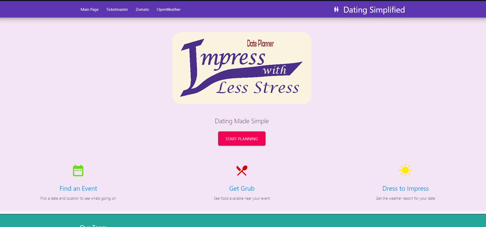
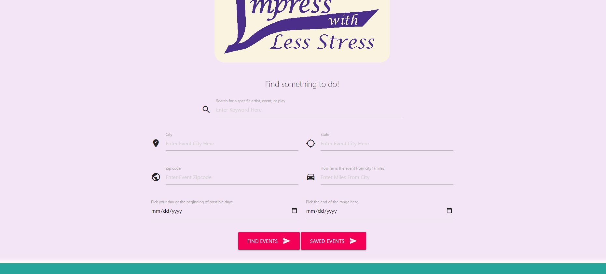
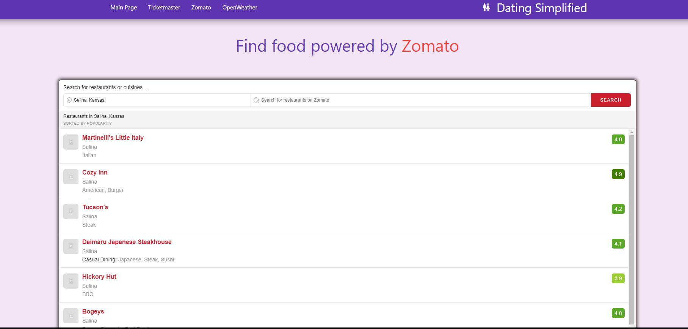
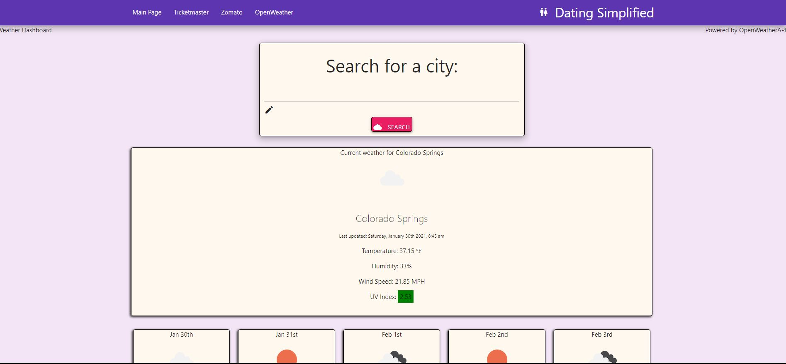
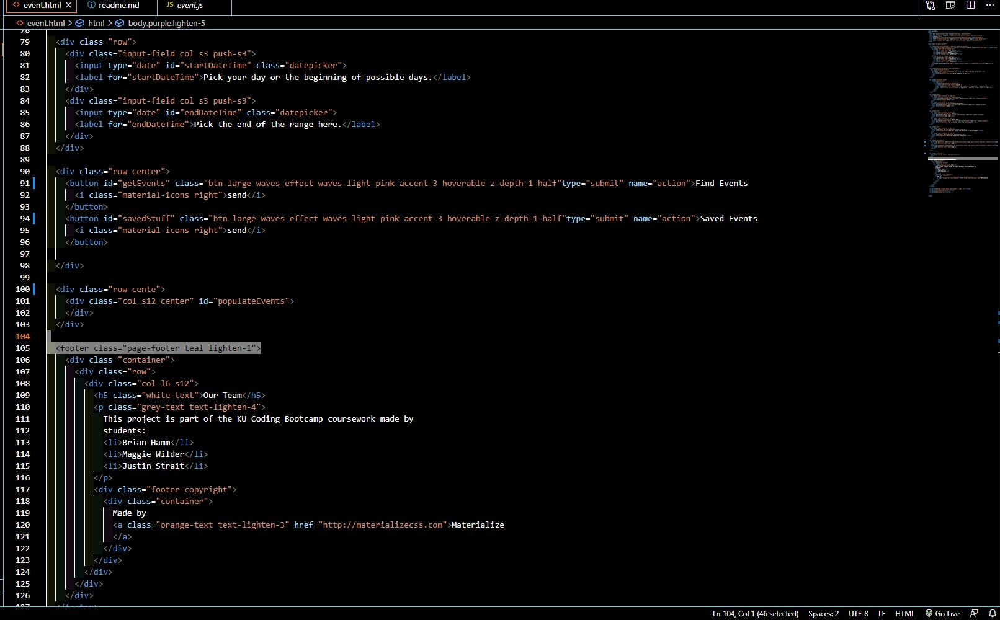
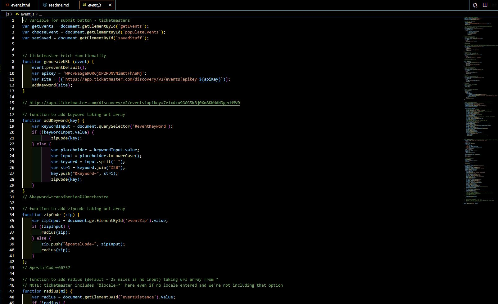

### * Acceptance Criteria *

### Application Requirements

Your project should fulfill the following requirements:

* Use a CSS framework other than Bootstrap.

* Be deployed to GitHub Pages.

* Be interactive (i.e., accept and respond to user input).

* Use at least two server-side APIs.

* Does not use alerts, confirms, or prompts (use modals).

* Use client-side storage to store persistent data.
* Be responsive.

* Have a polished UI.

* Have a clean repository that meets quality coding standards (file structure, naming conventions, follows best practices for class/id naming conventions, indentation, quality comments, etc.).

* Have a quality README (with unique name, description, technologies used, screenshot, and link to deployed application).

### Here is the [Github Repo](https://github.com/JuStrait/TeamProject1/) 

### Here is the [Deployed Page](https://justrait.github.io/TeamProject1/)

